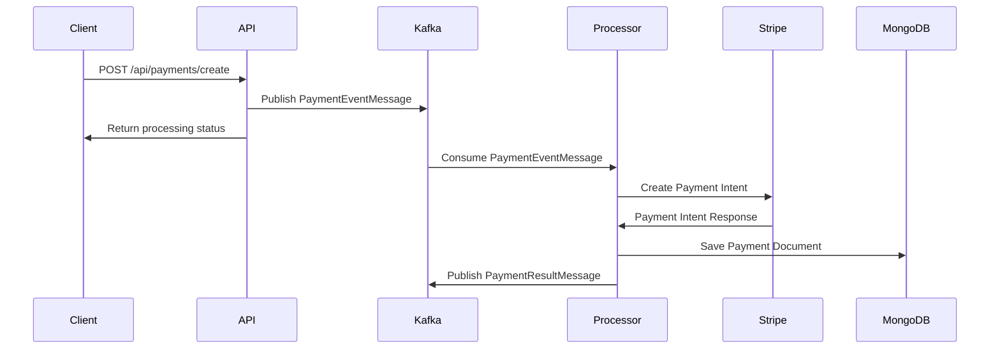
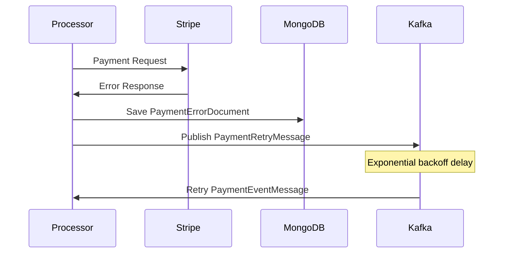

# Payment System with Pub-Sub Pattern

## Overview

The payment system has been refactored to use a **Publisher-Subscriber (Pub-Sub)** pattern with **Apache Kafka** for message queuing, **Polly** for retry policies, and **MongoDB** for error persistence. This architecture provides better scalability, reliability, and fault tolerance.

## Architecture

### 🏗️ **System Components**

#### **1. API Layer (Publisher)**
- **FastEndpoints**: High-performance API endpoints
- **PaymentQueueService**: Publishes payment events to Kafka
- **Immediate Response**: Returns processing status immediately

#### **2. Message Queue (Kafka)**
- **Payment Events Topic**: Receives payment processing requests
- **Payment Results Topic**: Publishes processing results
- **Retry Topic**: Handles failed payments for retry

#### **3. Payment Processor Service (Consumer)**
- **Background Service**: Processes payment events from Kafka
- **Retry Policies**: Exponential backoff with Polly
- **Error Handling**: Comprehensive error management

#### **4. Data Persistence**
- **MongoDB**: Stores payment documents and error logs
- **Error Tracking**: Persistent error storage for retry

## 🔧 **Implementation Details**

### **1. Abstract Message Queue Interface**

```csharp
public interface IMessageQueue
{
    Task PublishAsync<T>(string topic, T message, string? key = null) where T : class;
    Task SubscribeAsync<T>(string topic, string groupId, Func<T, Task> handler, CancellationToken cancellationToken = default) where T : class;
    Task<QueueStatus> GetStatusAsync();
}
```

### **2. Kafka Implementation**

```csharp
public class KafkaMessageQueue : IMessageQueue, IDisposable
{
    private readonly IProducer<string, string> _producer;
    private readonly IConsumer<string, string> _consumer;
    
    // Producer configuration with idempotence
    // Consumer configuration with manual commit
    // Error handling and logging
}
```

### **3. Payment Queue Service**

```csharp
public class PaymentQueueService : IPaymentService
{
    private readonly IMessageQueue _messageQueue;
    private readonly AsyncRetryPolicy<PaymentResponse> _retryPolicy;
    
    // Publishes events to Kafka
    // Returns immediate processing status
    // Handles retry policies with exponential backoff
}
```

### **4. Payment Processor Service**

```csharp
public class PaymentProcessorService : BackgroundService
{
    // Consumes messages from Kafka
    // Processes payment events
    // Handles errors and retries
    // Publishes results back to Kafka
}
```

## 📊 **Message Flow**

### **Payment Creation Flow**



### **Error Handling Flow**



## 🚀 **Features**

### **1. Pub-Sub Pattern**
- ✅ **Decoupled Architecture**: API and processing are separated
- ✅ **Scalability**: Multiple processors can handle load
- ✅ **Reliability**: Message persistence in Kafka
- ✅ **Fault Tolerance**: Automatic retry mechanisms

### **2. Retry Policies (Polly)**
- ✅ **Exponential Backoff**: 1s, 2s, 4s, 8s, 16s, 30s (max)
- ✅ **Circuit Breaker**: Prevents cascading failures
- ✅ **Timeout Handling**: Configurable timeouts
- ✅ **Error Classification**: Different retry strategies per error type

### **3. Error Persistence**
- ✅ **MongoDB Storage**: Persistent error logs
- ✅ **Error Statistics**: Comprehensive error analytics
- ✅ **Retry Scheduling**: Automatic retry scheduling
- ✅ **Error Resolution**: Manual error resolution

### **4. Message Types**

#### **PaymentEventMessage**
```json
{
  "messageId": "guid",
  "paymentId": "pi_1234567890",
  "customerId": "cus_1234567890",
  "amount": 2000,
  "currency": "USD",
  "paymentMethodId": "pm_1234567890",
  "description": "Payment for order #12345",
  "eventType": "CreatePayment",
  "retryCount": 0,
  "maxRetryAttempts": 3
}
```

#### **PaymentResultMessage**
```json
{
  "messageId": "guid",
  "originalMessageId": "guid",
  "paymentId": "pi_1234567890",
  "success": true,
  "status": "succeeded",
  "amount": 2000,
  "currency": "USD",
  "processingTimeMs": 1500
}
```

#### **PaymentRetryMessage**
```json
{
  "messageId": "guid",
  "originalMessageId": "guid",
  "paymentEvent": { /* PaymentEventMessage */ },
  "errorMessage": "Card declined",
  "retryCount": 1,
  "retryDelaySeconds": 120
}
```

## 🔧 **Configuration**

### **Kafka Settings**
```json
{
  "KafkaSettings": {
    "BootstrapServers": "localhost:9092",
    "ClientId": "template-backend",
    "ConsumerGroupId": "template-backend-group",
    "PaymentTopic": "payment-events",
    "PaymentResultTopic": "payment-results",
    "SubscriptionTopic": "subscription-events",
    "RetryTopic": "payment-retry"
  }
}
```

### **Retry Policy Configuration**
```csharp
var retryPolicy = Policy<PaymentResponse>
    .Handle<StripeException>()
    .Or<HttpRequestException>()
    .Or<TimeoutException>()
    .WaitAndRetryAsync(
        retryCount: 3,
        sleepDurationProvider: retryAttempt => TimeSpan.FromSeconds(Math.Pow(2, retryAttempt))
    );
```

## 📈 **Benefits**

### **1. Scalability**
- **Horizontal Scaling**: Multiple payment processors
- **Load Distribution**: Kafka partitions for parallel processing
- **Async Processing**: Non-blocking API responses

### **2. Reliability**
- **Message Persistence**: Kafka stores messages
- **Error Recovery**: Automatic retry mechanisms
- **Fault Isolation**: Errors don't affect API availability

### **3. Monitoring**
- **Error Tracking**: Comprehensive error logging
- **Performance Metrics**: Processing time tracking
- **Queue Monitoring**: Kafka topic monitoring

### **4. Development**
- **Separation of Concerns**: Clear service boundaries
- **Testability**: Easy to unit test components
- **Maintainability**: Modular architecture

## 🚀 **Deployment**

### **1. API Service**
```bash
cd src/TemplateBackend.API
dotnet run
```

### **2. Payment Processor Service**
```bash
cd src/TemplateBackend.PaymentProcessor
dotnet run
```

### **3. Infrastructure (Docker)**
```yaml
# docker-compose.yml
version: '3.8'
services:
  kafka:
    image: confluentinc/cp-kafka:latest
    ports:
      - "9092:9092"
  
  zookeeper:
    image: confluentinc/cp-zookeeper:latest
    ports:
      - "2181:2181"
  
  mongodb:
    image: mongo:latest
    ports:
      - "27017:27017"
```

## 📊 **Monitoring & Observability**

### **1. Health Checks**
- **Kafka Connectivity**: Message queue health
- **MongoDB Connection**: Database health
- **Payment Processor**: Service health

### **2. Metrics**
- **Message Throughput**: Events per second
- **Processing Time**: Average processing duration
- **Error Rate**: Failed payments percentage
- **Retry Count**: Average retries per payment

### **3. Logging**
- **Structured Logging**: Serilog integration
- **Error Context**: Detailed error information
- **Performance Tracking**: Processing time logs

## 🔍 **Error Handling**

### **1. Error Types**
- **StripeApiError**: Stripe API failures
- **NetworkError**: Connection issues
- **ValidationError**: Input validation failures
- **TimeoutError**: Request timeouts
- **UnknownError**: Unexpected errors

### **2. Retry Strategy**
- **Exponential Backoff**: Increasing delays
- **Maximum Retries**: Configurable retry limits
- **Error Classification**: Different strategies per error type
- **Dead Letter Queue**: Final failure handling

### **3. Error Persistence**
- **MongoDB Storage**: Persistent error logs
- **Error Context**: Full error details
- **Retry Scheduling**: Automatic retry timing
- **Resolution Tracking**: Manual resolution support

## 🧪 **Testing**

### **1. Unit Tests**
```csharp
[Test]
public async Task ProcessPaymentEvent_ValidEvent_ReturnsSuccess()
{
    // Arrange
    var paymentEvent = new PaymentEventMessage { /* ... */ };
    
    // Act
    var result = await _paymentQueueService.ProcessPaymentEventAsync(paymentEvent);
    
    // Assert
    Assert.IsTrue(result.Success);
}
```

### **2. Integration Tests**
```csharp
[Test]
public async Task PaymentFlow_EndToEnd_CompletesSuccessfully()
{
    // Test complete payment flow from API to processor
}
```

### **3. Load Tests**
```csharp
[Test]
public async Task PaymentProcessor_ConcurrentPayments_HandlesLoad()
{
    // Test concurrent payment processing
}
```

## 🔧 **Troubleshooting**

### **1. Common Issues**
- **Kafka Connection**: Check bootstrap servers
- **MongoDB Connection**: Verify connection string
- **Stripe API**: Validate API keys
- **Message Processing**: Check consumer group

### **2. Debug Commands**
```bash
# Check Kafka topics
kafka-topics --list --bootstrap-server localhost:9092

# Monitor payment events
kafka-console-consumer --topic payment-events --bootstrap-server localhost:9092

# Check MongoDB collections
mongo TemplateBackendDb --eval "db.paymenterrors.find()"
```

### **3. Log Analysis**
```bash
# Check payment processor logs
tail -f logs/payment-processor-*.txt

# Check API logs
tail -f logs/template-backend-*.txt
```

## 📚 **Best Practices**

### **1. Message Design**
- **Idempotency**: Handle duplicate messages
- **Schema Evolution**: Version message schemas
- **Error Handling**: Comprehensive error context
- **Performance**: Optimize message size

### **2. Retry Strategy**
- **Exponential Backoff**: Avoid thundering herd
- **Maximum Retries**: Prevent infinite loops
- **Error Classification**: Different strategies per error
- **Dead Letter Queue**: Handle permanent failures

### **3. Monitoring**
- **Health Checks**: Service availability
- **Metrics**: Performance monitoring
- **Logging**: Structured logging
- **Alerting**: Proactive error detection

This refactored payment system provides a robust, scalable, and maintainable solution for payment processing with comprehensive error handling and monitoring capabilities! 🚀✨ 